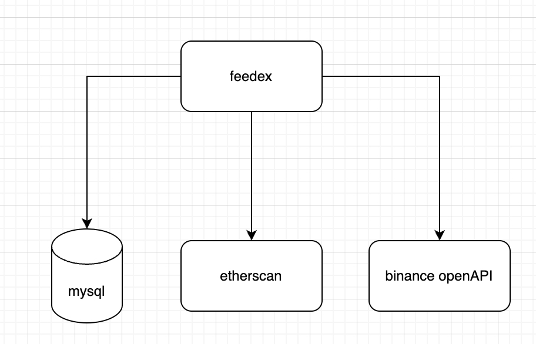

# feedex
demo for querying trx fee of uniswap

# Requirements
- Realtime data recording of UniswapV3 USDC/ETH pool transaction fee
- Historical data batch data recording of UniswapV3 USDC/ETH pool transaction fee
- Convert fee in ETH to USDT using historical/live price for ETH/USDT 
- Batch query by given time period
- Single query by given transaction hash

## Tech Requirements
- RESTful API follwoing Swagger UI standards
- Read config from file
- Gracefully start and stop
- Rate limit for external api calls
- Dockerize your applications withdocker-compose

# Tech Design
## Database Design
We can use mysql to store all the required data of UniswapV3 USDC/ETH transactions.
```
-- trx_fee.uni_trx_fee definition

CREATE TABLE `uni_trx_fee` (
  `id` bigint NOT NULL AUTO_INCREMENT COMMENT 'auto-generated primary key',
  `symbol` varchar(100) NOT NULL DEFAULT 'WETH/USDC' COMMENT 'symbol',
  `trx_hash` varchar(100) NOT NULL DEFAULT '' COMMENT 'transaction hash',
  `trx_time` bigint unsigned NOT NULL DEFAULT '0' COMMENT 'timestamp of transaction',
  `gas_used` bigint unsigned NOT NULL DEFAULT '0',
  `gas_price` bigint NOT NULL DEFAULT '0',
  `eth_usdt_price` decimal(10,0) NOT NULL DEFAULT '0',
  `trx_fee_usdt` decimal(10,0) NOT NULL DEFAULT '0',
  `gmt_created` timestamp NOT NULL DEFAULT CURRENT_TIMESTAMP,
  PRIMARY KEY (`id`),
  UNIQUE KEY `trx_hash_unique` (`trx_hash`)
) ENGINE=InnoDB DEFAULT CHARSET=utf8mb4 COLLATE=utf8mb4_0900_ai_ci;
```

## API Design
### Query trsanction fee of single transaction
input: 
- trx_hash, string

output:
- trx_fee, string, decimal number

### Batch query transaction fees given time period
input:
- symbol, string, WETH/USDC by default
- start_time, int, unix timestamp in seconds
- end_time, int, unix timestamp in seconds
- limit, int, limit of results size, 20 by default
- page, int, starting from 0

output:
- result, array of json struct
  - TrxHash, string
  - TrxFeeUsdt, string, decimal number
  - TrxTime, int, unix timestamp in seconds

## Architecture


# Build & Run

## build

## Swagger docs

visit `http://localhost:8080/swagger/index.html`

# Test
Unit tests are mainly generated by ChatGPT.